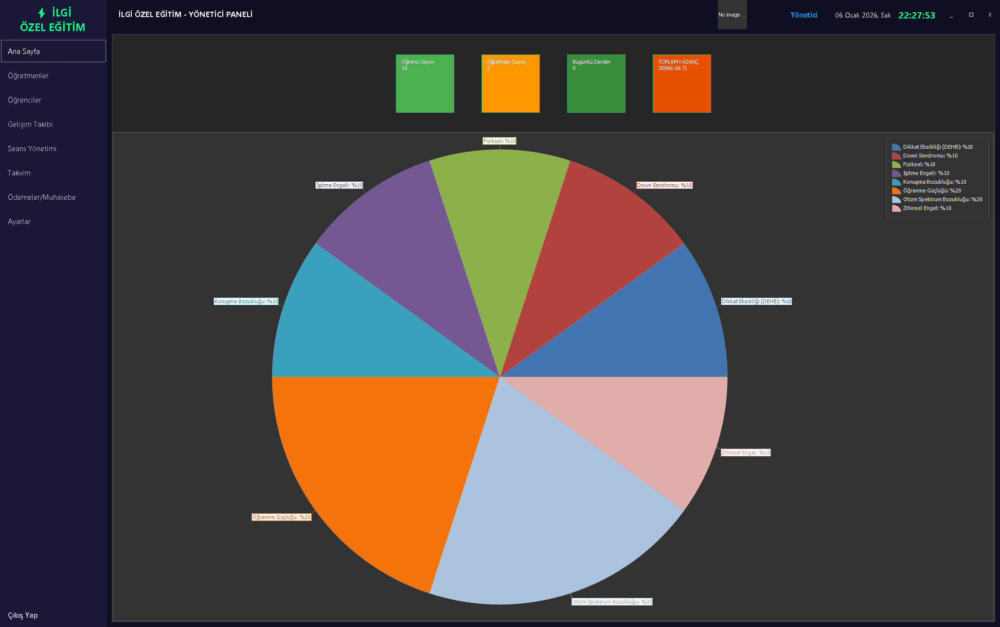
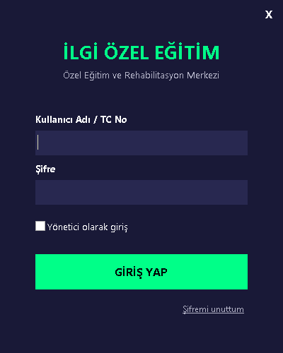
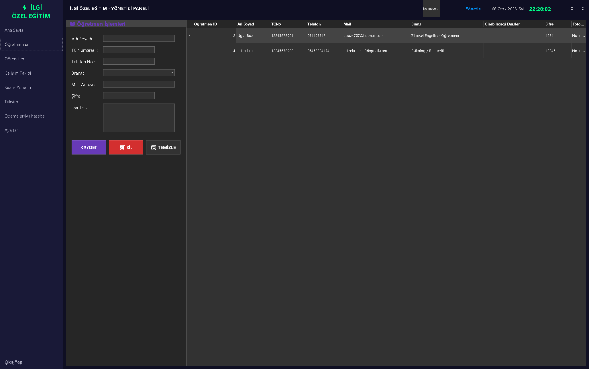
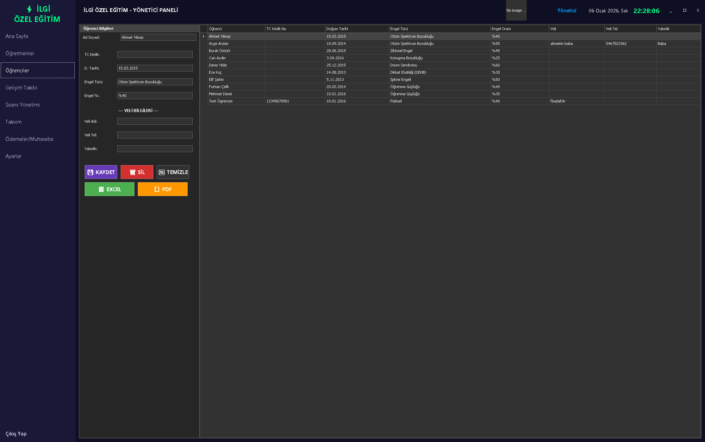
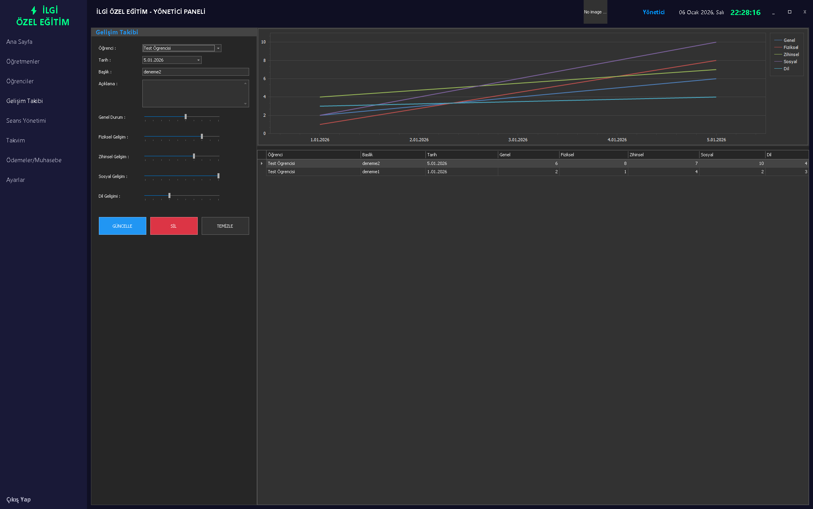
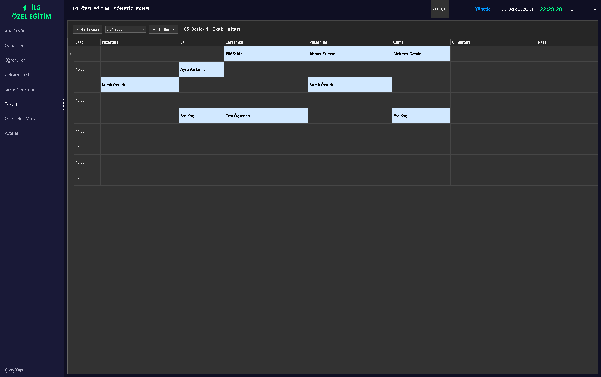
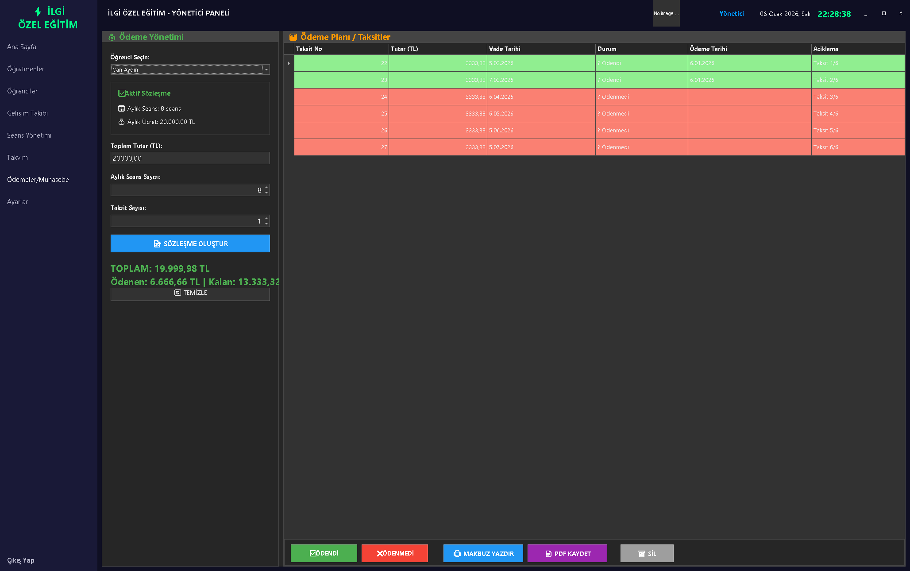
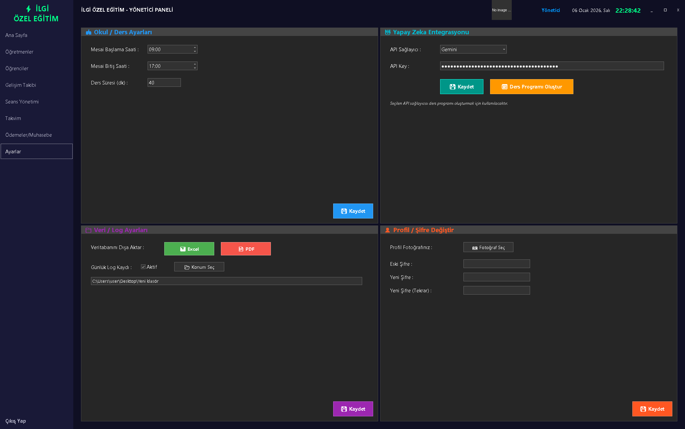
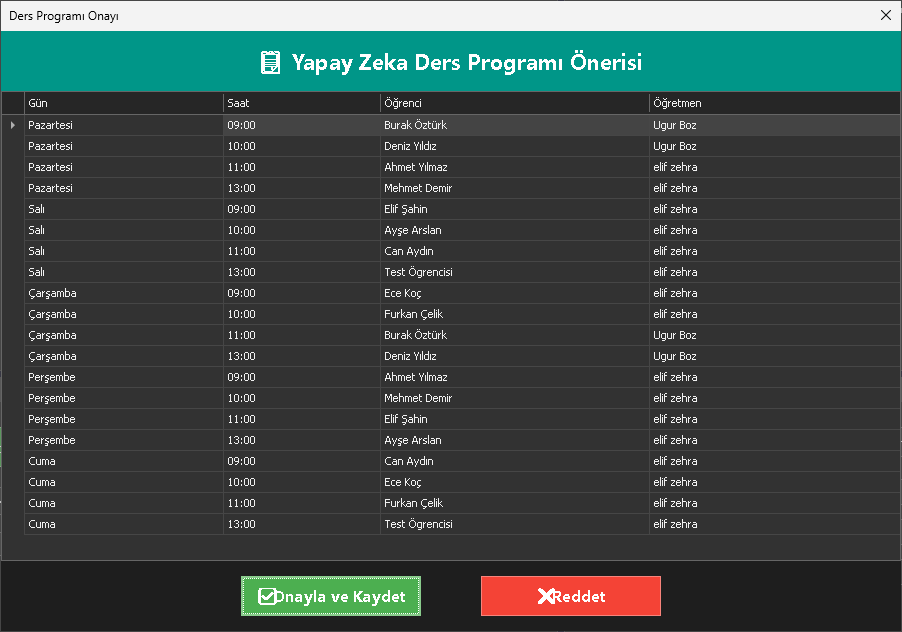

# 🎓 Özel Öğrenci Okul Otomasyonu

[](https://dotnet.microsoft.com/)
[](https://www.devexpress.com/)
[](https://www.microsoft.com/sql-server)
[](LICENSE)

## 📌 Proje Hakkında

Bu proje, **özel eğitim ve rehabilitasyon merkezlerinin** günlük operasyonlarını dijitalleştirmek amacıyla geliştirilmiş kapsamlı bir **okul yönetim sistemidir**.

### Ne Yapar?
- 📋 **Öğrenci kayıt ve takip** işlemlerini yönetir
- 👨‍🏫 **Öğretmen atama** ve branş yönetimini sağlar
- 🤖 **Yapay zeka ile otomatik ders programı** oluşturur (Gemini/ChatGPT API)
- 📈 **Öğrenci gelişim grafiklerini** takip eder ve raporlar
- 💰 **Ücretlendirme, taksit ve ödeme** süreçlerini yönetir
- 📊 **Dashboard** ile anlık istatistikleri görselleştirir

### Neden Bu Proje?
Özel eğitim kurumları manuel süreçlerle çalışırken veri kaybı, takip zorluğu ve zaman kaybı yaşar. Bu sistem tüm süreçleri **tek merkezde** toplar, **veri bütünlüğünü** sağlar ve **yönetimsel kararları** hızlandırır.



---

## ⬇️ Kurulum

| İndir | Açıklama |
|-------|----------|
| [📦 setup.exe](setup.exe) | Tek tıkla kurulum |
| [💿 MSI Installer](Ozel%20Ogrenci%20Okul%20Otomasyonu.msi) | Windows Installer |
| [🔖 Releases](../../releases) | Tüm sürümler |

> **Gereksinimler:** .NET Framework 4.7.2, SQL Server

---

## ✨ Özellikler

| Modül | Açıklama |
|-------|----------|
| 👥 **Öğrenci Yönetimi** | Kayıt, profil, gelişim takibi ve raporlama |
| 👨‍🏫 **Personel Yönetimi** | Öğretmen atamaları, branş ve ders yükü |
| 📅 **Ders Programı** | AI destekli otomatik planlama |
| 💰 **Finans** | Ücretlendirme, taksit ve tahsilat takibi |
| ⚙️ **Sistem** | Merkezi ayarlar ve yetki yönetimi |

---

## 🛠️ Teknoloji

```
C# • .NET Framework 4.7.2 • DevExpress WinForms • SQL Server • ADO.NET
```

**Mimari:** Katmanlı Mimari (Layered Architecture) • OOP • SDLC

---

## 📸 Ekran Görüntüleri

<details>
<summary>🔐 Giriş</summary>


</details>

<details>
<summary>👨‍🏫 Öğretmen Yönetimi</summary>


</details>

<details>
<summary>👥 Öğrenci Yönetimi</summary>


</details>

<details>
<summary>📈 Gelişim Takibi</summary>


</details>

<details>
<summary>📅 Haftalık Program</summary>


</details>

<details>
<summary>💰 Ödeme Takibi</summary>


</details>

<details>
<summary>⚙️ Ayarlar</summary>


</details>

<details>
<summary>🤖 AI Ders Planlama</summary>


</details>

---

## 🚀 Geliştirici Kurulumu

```bash
git clone https://github.com/ugurboz/Ozel-Ogrenci-Okul-Otomasyonu.git
```

1. Visual Studio ile açın
2. NuGet paketlerini restore edin
3. `sqlYardimcisi.cs` bağlantı ayarlarını kontrol edin
4. F5 ile çalıştırın

---

## 👤 Geliştirici

**Uğur Boz** — Fırat Üniversitesi, Yazılım Mühendisliği

---

## 📄 Lisans

[MIT License](LICENSE)